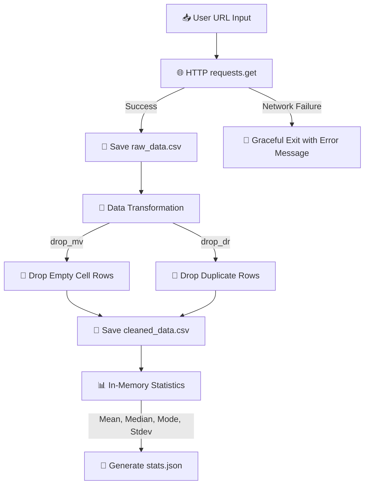

# 🚢 Automated Data Pipeline CLI Tool

[](https://www.python.org/)
[](https://opensource.org/licenses/MIT)
[](https://pypi.org/project/requests/)

A robust, modular, production-ready CLI data pipeline. It fetches public CSV datasets from any endpoint, performs dual-filter cleaning (missing cells + duplicate rows), runs in-memory statistical calculations, and outputs structured analytical reports.

Built **strictly on Python's standard library** (with the sole exception of `requests`), emphasizing robust error handling, memory efficiency, and clean CLI usability.

---

## 🗺️ Pipeline Architecture



---

## ✨ Key Features

- **🌐 Robust Web Extraction** — Downloads CSV files from remote repositories (GitHub, Kaggle, APIs) with a protective **10-second request timeout** to prevent process hanging.
- **🧹 Flexible Dual-Cleaning Filters**
  - `drop_mv` — discards rows containing empty cells or whitespace fields.
  - `drop_dr` — removes duplicate rows using unique tuple-set hashing.
- **📊 In-Memory Analytics** — Automatically scans columns for numeric values, filters non-numeric cells on the fly, and calculates descriptive metrics: `average`, `median`, `mode`, and `standard deviation`.
- **🛡️ Bulletproof Exception Handling** — Guards against connection loss, write-permission errors (locked output files), missing path directories, empty datasets, and mathematical anomalies (e.g. division by zero, no unique mode).

---

## 📂 Project Structure

```text
Automated Data Pipeline CSV/
│
├── gitreadme.md              # This GitHub documentation file
├── Project_Overview.md       # Pipeline architecture and full source code
├── learnings.md              # Advanced Python syntax explained via project examples
├── README.md                 # Local setup guide
│
└── data/                     # Output directory (created dynamically)
    ├── raw_data.csv           # Raw downloaded dataset
    ├── cleaned_data.csv       # Cleaned, filtered dataset
    └── stats.json             # Statistical summary report
```

---

## ⚡ Quick Start

### 1. Set Up the Environment

Clone this repository, navigate to the project directory, and create a virtual environment:

```bash
# Create the virtual environment
python -m venv venv

# Activate it (Windows PowerShell)
.\venv\Scripts\Activate.ps1

# Activate it (macOS/Linux)
source venv/bin/activate
```

### 2. Install Dependencies

```bash
pip install requests
```

### 3. Run the Tool

```bash
python Automated_data_pipeline_script.py
```

---

## ⚙️ CLI Flags & Options

Configure the pipeline directly from the terminal:

| Argument    | Shorthand | Type     | Default            | Description                                              |
|-------------|-----------|----------|--------------------|-----------------------------------------------------------|
| `--url`     | `-u`      | `String` | *Titanic Dataset URL* | HTTP URL of the public CSV dataset to download.         |
| `--output`  | `-o`      | `String` | `data/`            | Directory path where output files will be written.        |
| `--clean`   | `-c`      | `String` | `all`              | Cleaning strategy: `drop_mv`, `drop_dr`, or `all`.         |
| `--stats`   | `-s`      | `String` | `Yes`              | Calculate statistics: `Yes`, `y`, `No`, or `n`.            |

### Command Examples 🚀

**Download, clean duplicates only, and calculate stats:**
```bash
python Automated_data_pipeline_script.py --clean drop_dr
```

**Process a custom dataset and save outputs to a custom folder:**
```bash
python Automated_data_pipeline_script.py --url "https://your-data-source.csv" --output "results/"
```

**Process the dataset and skip generating the statistics JSON:**
```bash
python Automated_data_pipeline_script.py --stats No
```

---

## 📝 Output Preview

The tool produces structured results in both tabular (CSV) and analytical (JSON) form.

### `stats.json` Preview

```json
{
  "PassengerId average": 446.0,
  "PassengerId median": 446.0,
  "PassengerId mode": "No unique Value",
  "PassengerId std_dev": 257.3538420152301,
  "Survived average": 0.3838383838383838,
  "Survived median": 0.0,
  "Survived mode": [0.0],
  "Survived std_dev": 0.4865924542648585,
  "Pclass average": 2.308641975308642,
  "Pclass median": 3.0,
  "Pclass mode": [3.0],
  "Pclass std_dev": 0.8360712409770513,
  "Age average": 29.69911764705882,
  "Age median": 28.0,
  "Age mode": [24.0],
  "Age std_dev": 14.526497332334044
}
```

---

## 🛡️ Error Handling Architecture

The pipeline is built to stay stable and avoid raw tracebacks under all scenarios:

- **🔌 Connection Loss** — Catches `requests.exceptions.RequestException` to alert the user if they're offline or the target server is down.
- **🔒 File Write Permissions** — Wraps I/O writes in a try/except catching `PermissionError` and `FileNotFoundError`, notifying the user if output files are open in Excel or locked by admin privileges.
- **📦 Empty Datasets** — Validates both file size and parsed contents before reading. If cleaning removes 100% of the entries, exits with a clear warning instead of attempting stats.
- **🧮 Math Calculations** — Guards standard deviation from crashing when the dataset has fewer than 2 items, writing `"Insufficient Data"` to the metrics dictionary instead of failing.

---

## 📄 License

Licensed under the [MIT License](https://opensource.org/licenses/MIT).